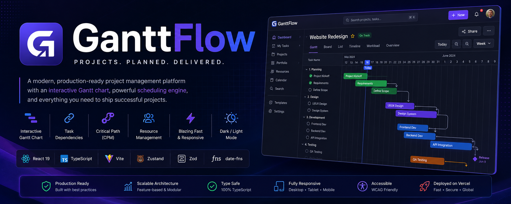

# 📊 Gantt Flow

🔗 Live Demo: https://gantt-flow-eta.vercel.app

---

## 🧠 About

A modern interactive **Gantt chart project management tool** that helps users plan, visualize, and manage tasks using a timeline-based interface.

---

## ✨ Features

- 📅 Interactive Gantt timeline
- 🧩 Task creation and organization
- 🖱️ Drag & drop scheduling
- 📊 Real-time updates
- ⚡ Smooth UI interactions
- 📱 Fully responsive design

---

## ⚙️ Tech Stack

- React + TypeScript
- Vite
- Zustand
- Zod
- Tailwind CSS
- Vercel

---

## 📁 Project Structure

/src
  /components
  /store
  /hooks
  /utils
  /types

---

## 🚀 Purpose

This project focuses on transforming traditional project management into a **visual and interactive experience**, improving clarity and workflow planning.

---

## 👨‍💻 Author

Built by **Tamer Sameh**

Frontend Developer | BIS Student